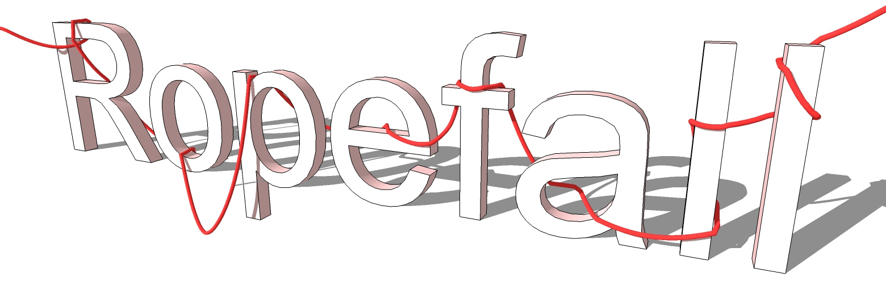
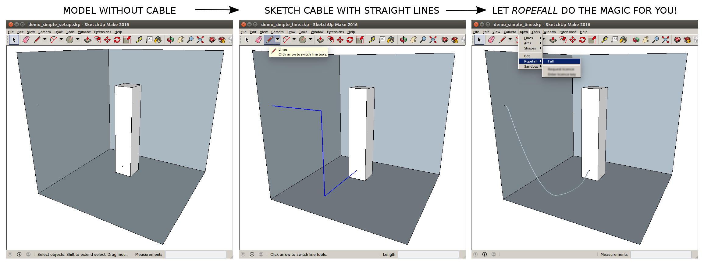
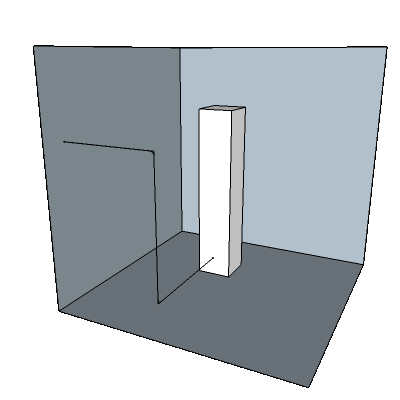
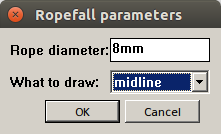
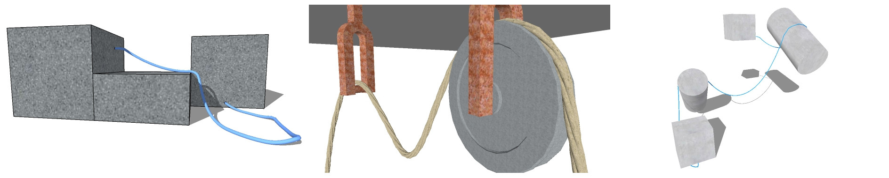

# Ropefall was a SketchUp plugin to model ropes, cables, wires. 
The algorithm uses physics simulation of a rope falling to bottom, stopped by obstacles on the way falling down. In this repository you find the source code of it.

Let\'s see how Ropefall works:

Animated:

The algorithm simulates a rope that drops downward to the bottom of the
model. The falling rope can be blocked by obstacles in the way. The two
ends of the rope won\'t fall down as they are fixed.

1\. Activate the line tool and draw a polyline defining the initial
shape of the rope.

2\. Activate the select tool and select the polyline.

3\. Click menu Draw → Ropefall → Fall.

4\. Specify rope parameters and click the \'ok\' button to start
simulation.

5\. Wait until simulation ends or stop it with the Esc key.

TIP:
- make the simulation faster by hiding parts of the model that do not
block the rope from falling\
- use some helper objects to control the shape of the rope

Supported SketchUp versions: 2015+

